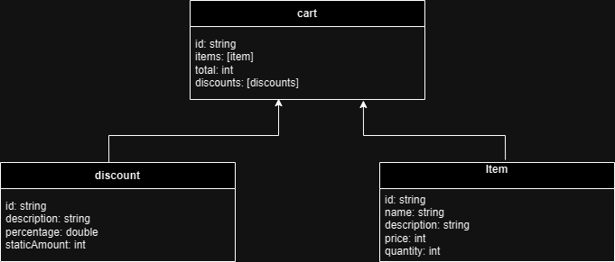

## Follow-up questions

#### How long did you spend on the test? What would you add if you had more time?

I spent approximately 6-8 hours on the test. If I had more time, I would have added the following:

- **Enhanced Error Handling**: Implement more comprehensive error handling to cover a wider range of scenarios.
- **Security Improvements**: Implement additional security measures such as authentication and authorization.
- **Logging and Monitoring**: Implement more robust logging and monitoring to track and analyze system behavior.

#### What was the most useful feature that was added to the latest version of your chosen language? Please include a snippet of code that shows how you've used it.

Two of the most useful features added to Java recently are Virtual Threads and Pattern Matching in switch statements.

##### Virtual Threads

Virtual Threads, are lightweight, efficient threads designed to improve the scalability and performance of concurrent
applications.

The approach is pretty similar to what Go did with the `'go-routines'`, which allows to run a blocking process in a
thread without blocking the thread, when it blocks, it releases the physical thread and allows for another virtual
thread
run using the same thread until the first process unblocks.

The use of this is the same as a normal `Thread`, these are instances
of `Thread`. [See official docs](https://docs.oracle.com/en/java/javase/21/core/virtual-threads.html)

##### Pattern Matching in `switch` statements

Pattern matches simplifies and makes more intuitive the use of switch statements, making the code more readable and
maintainable. This one was introduced in Java 17.

For example, here's pre java 17:

```java
public void someMethod(Object o) {
    if (o instanceof String s) {
        System.out.println("is a string!" + s);
    }
    if (o instanceof Integer i) {
        System.out.println("is an integer!" + i);
    }
    if (o instanceof Double d) {
        System.out.println("is a double!" + d);
    }
}
```

Now you can do something like:

```java
public void someMethod(Object o) {
    switch (o) {
        case String s -> System.out.println("is a string!" + s);
        case Integer i -> System.out.println("is an integer!" + i);
        case Double d -> System.out.println("is a double!" + d);
    }
}
```

#### What mechanism did you put in place to track down issues in production on this code? If you didn’t put anything, write down what you could do.

To track down issues in production, I would implement the following mechanisms:

- Logging: Implement comprehensive logging throughout the application to record events, errors, and transactions. For
  example:
- Monitoring: Utilize monitoring tools to keep track of system health and performance in real-time. This could be
  achieved using tools like Grafana or Datadog.

#### The Wiremock represents one source of information. We should be prepared to integrate with more sources. List the steps that we would need to take to add more sources of items with different formats and promotions.

- Define Interfaces: Define interfaces that will be implemented by the classes representing each source of information.
- Implement New Sources: Implement the new sources by creating classes that implement the defined interfaces.
- Update Configuration: we can conditionally a service programmatically using `@Conditional`, which allow us to use one
  bean over another one at runtime, allowing to consume different sources.
  See [Spring Conditional Annotations](https://www.baeldung.com/spring-conditional-annotations) for references.

#### Entity relations diagram

